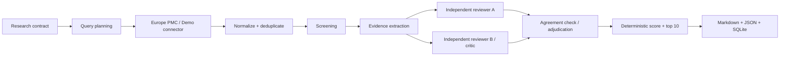

# Research Agent — milestone 1

Prototip Python + Pydantic + LangGraph, cu checkpointing SQLite și raport Markdown/JSON.
Primul milestone demonstrează întregul circuit pe un topic, cu maximum 30 de candidați
și cel mult 10 rezultate. Analizează **abstracte**, nu full-text.

## Pornire rapidă — fără chei API

Necesită Python 3.11+. Din acest director:

```sh
python3.12 -m venv .venv
source .venv/bin/activate
pip install -e '.[dev,live]'
research-agent "retrieval augmented generation" --mode demo --run-dir runs/demo
pytest -q
```

Deschide `runs/demo/report.md`. **Demo este integral sintetic**, inclusiv lucrările,
scorurile și review-urile. Verifică mecanica sistemului, nu performanța științifică a modelelor.
Demo generează 12 candidați și exercită deliberat ruta de adjudecare.

## Căutare și evaluare live

```sh
cp .env.example .env
# Completează model IDs și cheile furnizorilor în .env.
research-agent "retrieval augmented generation clinical question answering" \
  --mode live --max-papers 5 --run-dir runs/live-01
```

`RESEARCH_MODEL` configurează planner, screening și extraction. Reviewer A, reviewer B
și adjudicator au fiecare un override în `.env.example`. Format: `provider:model-id`.
Sunt incluse integrările LangChain pentru OpenAI și Anthropic; alte integrări pot fi adăugate.
Nu există un model live implicit, o cheie inclusă sau fallback silențios la demo.
Configurarea se citește la început și se salvează fără chei în manifest.
Topic-ul și abstractele sunt trimise furnizorilor configurați. Modelele sunt apelate fără tools.

Recomandat pentru primul run live: 5 candidați. Maximum apeluri logice pentru N candidați:
`1 + 5N` (planner, screening, extraction, două review-uri și eventual adjudecare).
Retry-urile furnizorului pot produce cereri suplimentare. Maximum 2 review-uri simultane;
restul lucrului per etapă este secvențial. Timeout model 60s, maximum 2 retry-uri SDK,
output limitat la 2500 tokens/apel. Nu este implementat un buget monetar strict.

## Reluare după întrerupere

```sh
research-agent "retrieval augmented generation" --run-dir runs/checkpoint --stop-after extract
research-agent --run-dir runs/checkpoint --resume
```

Aceeași comandă `--resume` reia și un run oprit de o excepție. Manifestul păstrează topic-ul,
modul și modelele. Checkpoint-urile sunt la granițele nodurilor; cache-ul SQLite al apelurilor
validate evită repetarea apelurilor deja salvate dintr-un nod parțial executat.
O cădere între răspunsul furnizorului și salvare poate repeta un apel: nu promitem exactly-once.
Un director existent nu poate fi suprascris cu un run nou. Un run complet poate regenera raportul.
Folosește o singură instanță CLI per director de run. Nu încărca baze checkpoint necunoscute.

## Arhitectură



| Modul | Responsabilitate |
|---|---|
| `schemas.py` | Contracte Pydantic, decizii, evidence, provenance, limite |
| `connectors.py` | Protocol Connector, Europe PMC, fixture, deduplicare |
| `agents.py` | Prompturi versionate, configurare modele, output structurat, cache auditabil |
| `graph.py` | Noduri LangGraph, review-uri paralele, barieră fan-in, adjudecare, scoring |
| `storage.py` | Raw payloads adresate prin hash, apeluri model, papers |
| `report.py` | Raport și export al întregii stări |
| `cli.py` | Inițializare, checkpoint persistent și resume |

Reviewer A și B primesc același topic, abstract și evidence, fără review-ul celuilalt.
A caută contribuția susținută; B atacă validitatea și extrapolările. Sunt independenți la
nivel de context, nu statistic: aceleași modele/evidence pot produce erori corelate.
Pentru diversitate, configurează modele diferite. Adjudicatorul vede ambele review-uri și sursa.

Dezacord = verdict diferit sau diferență de cel puțin 2 puncte pe orice componentă.
La acord folosim minimul scorurilor pe componentă și păstrăm observațiile ambilor evaluatori.
La dezacord, adjudicatorul produce scoruri și motiv; `uncertain` nu intră în top.

Scor v1 = `100 × (0.4 relevance + 0.3 methods + 0.3 support) / 4`, fiecare 0–4.
`methods` măsoară detaliile metodologice vizibile în abstract, nu calitatea verificată.
Scorul este o formulă deterministă aplicată unor judecăți LLM, deci ranking-ul live nu este
reproductibil numeric la apeluri noi. Cache-ul și snapshot-urile permit auditarea exactă a unui run.
Egalitățile se ordonează după ID stabil. Nu completăm artificial până la 10.

## Proveniență și persistență

Fiecare candidat păstrează ID, DOI normalizat, titlu, an, abstract, query, sursă, URL,
timestamp și hash-ul payload-ului original. Deduplicarea combină ID/DOI și, conservator,
titlu normalizat + an; nu combină prin titlu doi DOI cunoscuți diferiți.
Fiecare claim extras include un citat verificat ca substring exact al abstractului.
Această verificare dovedește existența citatului, nu faptul că acesta implică logic afirmația.

În directorul run-ului:

- `manifest.json`: contract, modele, versiuni prompt/scoring și pachete principale.
- `checkpoints.sqlite`: stare LangGraph, ramuri terminate și pasul următor.
- `research.sqlite`: tabele `raw`, `calls`, `papers`; input/output validat pentru fiecare apel.
- `report.json`: întregul traseu, inclusiv screening, evidence, review-urile separate și deciziile.
- `report.md`: top, strengths, assessment, takeaways, limitări și proveniență.

Erorile de rețea/schema/citate opresc rularea și păstrează checkpoint-ul; nu devin rezultate goale.
Conectorul reîncearcă tranzitorii 429/5xx și transport (3 încercări), cu timeout 30s.
Abstractele lipsă sunt păstrate ca `uncertain`, fără ranking. Screening `uncertain` cu abstract
continuă la evaluare. Căutarea goală produce explicit zero rezultate.

## Limitele acestui milestone și pașii următori

- Europe PMC este o sursă orientată spre biomedicină/life sciences, nu acoperire universală.
- O pagină de cel mult N rezultate per query, maximum 3 query-uri; maximum N candidați unici
  evaluați în ordinea descoperirii. Topul este în acest lot, nu în întreaga literatură.
- Nu există achiziție full-text, verificare de retrageri, screening dublu, risk-of-bias validat,
  normalizare a familiilor preprint/journal sau calibrare față de evaluatori umani.
- Un singur model de screening în M1; schema permite audit, dar nu rezolvă false negatives.
- Query planning și review-urile sunt apeluri de model delimitate, nu agenți autonomi cu tools.
- Nu există business translation, competitive intelligence sau implementare pgvector.

Milestone 2: eșantion real etichetat manual, măsurarea screening recall și a concordanței evaluatorilor,
full-text pentru surse deschise și extragere cu localizare pe secțiune/paragraf.
Milestone 3: mai multe conectoare, paginare/date, workers dinamici per lucrare și limite de cost.
Ulterior se poate înlocui Store cu PostgreSQL și adăuga embeddings; exportul `Paper`/`Evidence`/
`Decision` este punctul de extensie pentru consumatori downstream, fără a-i implementa acum.

## Evaluare (research-eval)

`research-eval` măsoară screening-ul față de un review sistematic (SR) publicat: lucrările incluse
în SR sunt pozitivele, restul candidaților găsiți de același query sunt negativele. Toate apelurile
modelelor se salvează în cache-ul SQLite al run-ului, iar `report` rulează offline din cache
(nu apelează niciodată API-uri) și poate reface cascada la orice pereche de praguri Jev.

```sh
research-eval build-gold sr_specs/x.yaml -o gold/x.json
research-eval screen gold/x.json --run-dir runs/eval-x --mode live
research-eval agreement gold/x.json --run-dir runs/eval-x --limit 40
research-eval report runs/eval-x --holdout runs/eval-y
```

- `build-gold`: rezolvă studiile SR în Europe PMC și îngheață setul gold (hash de conținut);
  `--max-candidates` (implicit 200) limitează numărul de candidați.
- `screen`: Jev și screening-ul LLM pe fiecare candidat cu abstract; reluabil, fără apeluri repetate.
  Cere `TYPESAFE_API_KEY` în `.env`, chiar și cu `--mode demo`. Un director de run acceptă un singur
  gold set; pentru alt gold folosește alt `--run-dir`.
- `agreement`: reviewer A/B pe toate pozitivele plus `--limit` negative eșantionate (seed fix);
  folosește aceleași modele ca `screen`.
- `report`: scrie `metrics.md` și `metrics.json` în directorul run-ului. `--holdout` primește
  directorul unui run, deja screenat, pe un ALT SR (același gold e refuzat). Dacă run-ul are
  răspunsuri Jev de la versiuni diferite ale modelului, `report` se oprește, iar
  `--allow-mixed-jev-versions` îl forțează.

Regula de recomandare: se recomandă perechea de praguri cu cele mai multe apeluri de screening economisite
dintre cele care nu pierd niciun pozitiv SR pe care `llm_only` îl păstrează (pe setul principal și, dacă e dat,
pe holdout); o pereche care pierde un pozitiv pe holdout e respinsă explicit în raport. `--target-recall`
este acum doar o constrângere suplimentară opțională (recall >= valoarea dată).

Rulează comenzile din rădăcina repo-ului: `.env` se citește din directorul curent.
CLI-ul principal `research-agent` are nivelul Jev în cascadă: `--jev` (doar live),
`--jev-min-confidence` (auto-include, implicit 0.6) și `--jev-exclude-min-confidence`
(auto-exclude, implicit 0.9, trebuie să fie cel puțin cât primul).

Format `sr.yaml`:

```yaml
name: ctffr-sr
citation: Autor et al. 2026
topic: deep learning CT-FFR
query: ("fractional flow reserve" AND "deep learning")
included:
  - doi: 10.1000/p1
  - title: Titlul unui studiu fără DOI
    year: 2024
```

Ce se măsoară: recall de retrieval și de screening (cu interval Wilson 95%), lista pozitivelor
ratate, sweep de praguri Jev (include/exclude) cu recomandare de praguri, kappa între
revieweri A și B (alături de acordul brut și prevalență). Erorile opresc comanda și se scriu în
`errors.log` în directorul run-ului (tip și mesaj, fără chei).

Limite:
- Precizia nu e metrica principală: „inclus în SR” reflectă criterii aplicate pe full-text,
  nu pe abstract, deci negativele nu sunt negative certe.
- Pragurile recomandate sunt netestate fără `--holdout` (se potrivesc pe același SR); cu un singur SR
  regula „fără pierderi față de llm_only” poate fi tot supra-potrivită.
- Dacă reviewerii A și B sunt din aceeași familie de modele, kappa e umflat (corelația erorilor).

## Documentație consultată

- [LangGraph persistence](https://docs.langchain.com/oss/python/langgraph/persistence)
- [SQLite checkpointer](https://reference.langchain.com/python/langgraph.checkpoint.sqlite/SqliteSaver)
- [LangChain model interface](https://docs.langchain.com/oss/python/langchain/models)
- [Europe PMC REST API](https://europepmc.org/RestfulWebService)

## Rezultate incluse

- [Raport demo complet](examples/demo/report.md)
- [Snapshot conector live, fără evaluare LLM](examples/live-connector/retrieved.json)
- [Verificări executate și limitele validării](VERIFICATION.md)
- `requirements.lock.txt`: versiunile exacte instalate pentru verificare.

## Interfață vizuală — Research Studio

```sh
pip install -e '.[dev,live,ui]'
research-ui
```

Deschide [Research Studio](http://127.0.0.1:8501). Interfața pornește local,
pe adresa 127.0.0.1. Necesită macOS sau Linux pentru blocarea exclusivă a rulărilor.

- **Cercetare nouă**: topic, mod demo/live, număr de candidați, modele pe rol,
  chei API și pauză opțională după o etapă.
- **Progres**: etape în lucru/încheiate/eșuate, actualizate automat; reluare din checkpoint.
- **Clasament**: scoruri vizuale, filtru de scor, puncte forte și idei principale.
- **Dovezi și evaluatori**: abstract, citate exacte, review-uri alăturate, adjudecare și surse.
- **Căutare și export**: query-uri, configurația folosită, raport Markdown și audit JSON.
- **Bibliotecă**: cercetările anterioare rămân accesibile și după repornirea interfeței.

Rulările pornesc în procese separate: închiderea paginii nu oprește cercetarea.
Datele noi sunt în `runs/`; `RESEARCH_RUNS_DIR` poate schimba acest director.
Setările nesensibile se păstrează în `runs/ui-settings.json`. Cheile introduse în pagină
sunt transmise numai procesului de cercetare și nu sunt salvate pe disc. Pentru reluare,
reintrodu cheile sau configurează-le în `.env`. Rulările păstrează modelele inițiale;
pentru a schimba modelul unei cercetări eșuate, pornește o cercetare nouă.
Progresul măsoară etape, nu timpul rămas. V1 nu oferă anulare în mijlocul unui apel LLM.
