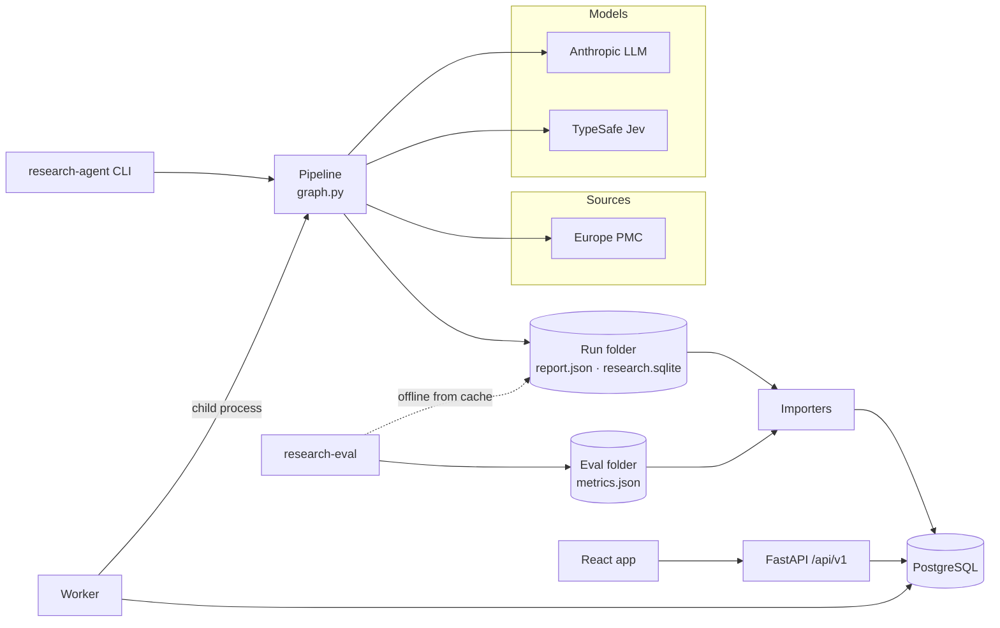
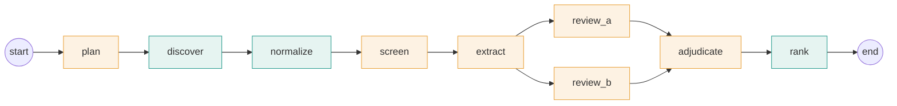
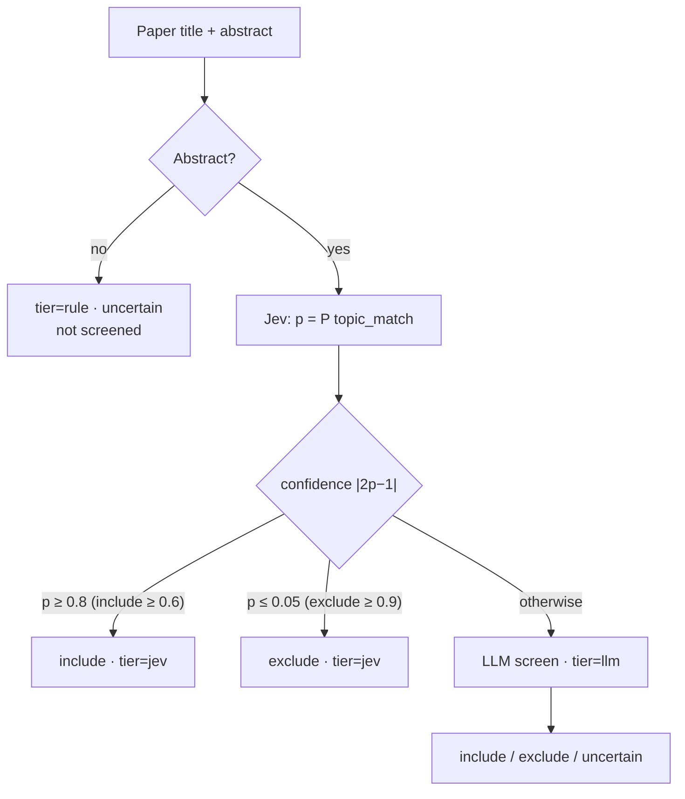
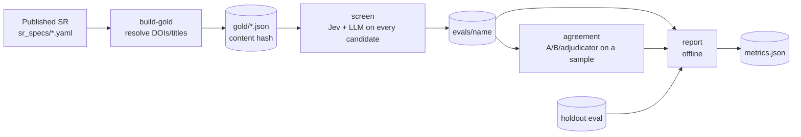
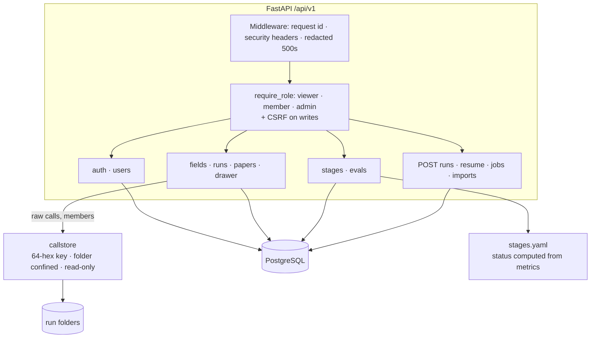
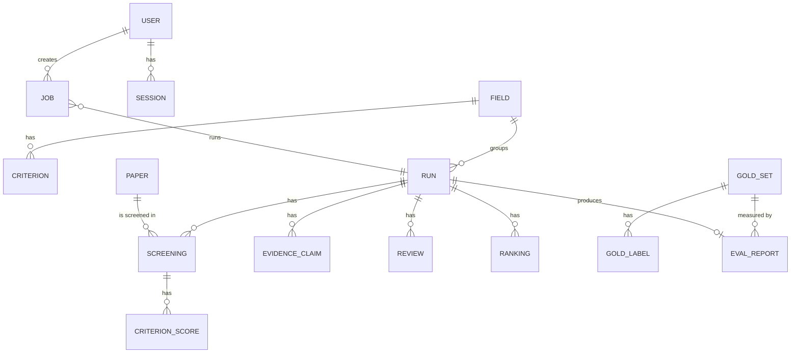
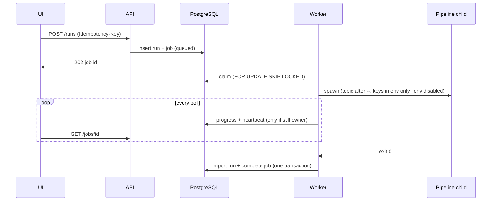
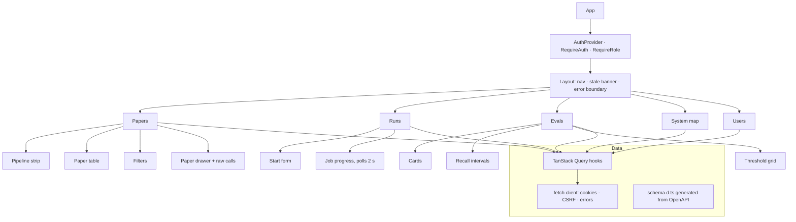
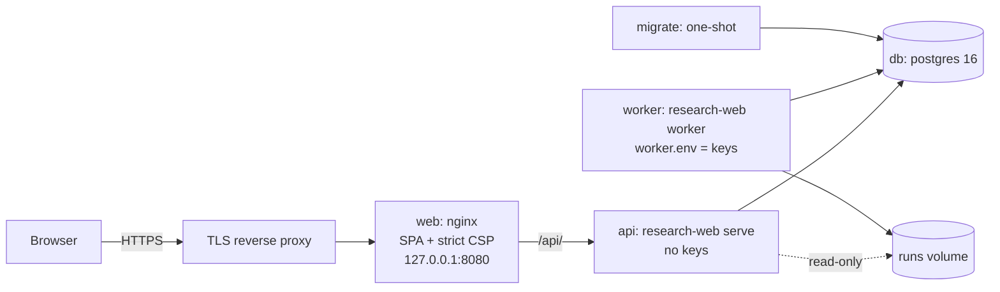

# Research Agent: architecture

Literature screening for medical-imaging AI: topic → search → dedupe → screen → extract → review →
rank, measured against published systematic reviews, browsable by a department in a web app.

Rules the design keeps: deterministic stages are code; the LLM extracts, the code scores; every claim
quotes the source exactly; fail closed; keys only in `.env` / the worker; measurement runs offline from
the call cache; the UI shows a stage as green only when it is measured.

## 1. System overview

| Module | Path | Role |
|---|---|---|
| Pipeline | `src/research_agent/{graph,agents,connectors,storage,report,cli}.py` | runs a research run |
| Jev tier | `src/research_agent/jev.py` | cheap confident screening, escalates to the LLM |
| Eval harness | `src/research_agent/eval/` | recall, threshold sweep, reviewer agreement |
| Web backend | `src/research_agent/web/` | DB, importers, auth, API, worker |
| Frontend | `web/` | React single-page app |
| Deployment | `deploy/`, `.github/workflows/ci.yml` | Compose, nginx, CI |

## 2. Pipeline (`graph.py`)

LangGraph state machine; each node checkpoints, so a failed run resumes (`--resume`).

- **Code (teal):** search (Europe PMC), dedupe, quote validation (`validate_evidence`), scoring and rank.
- **LLM (amber):** plan the query, screen, extract claims with exact quotes, two independent reviewers,
  an adjudicator only when they disagree.
- Every model call is cached in `research.sqlite` (`calls`), keyed by a digest of model, prompt version
  and input. This is the raw audit trail.

## 3. Screening cascade (`jev.py`)

Thresholds are asymmetric because losing a relevant paper costs more than reading an extra one. Raw
probabilities are cached, so thresholds can be changed and re-evaluated without new calls.

## 4. Eval harness (`eval/`)

`report` computes recall with Wilson intervals for `llm_only`, `jev_only` and `cascade`; sweeps every
threshold pair; recommends only pairs that lose no SR-included paper that `llm_only` keeps, on the main
set **and** the holdout; and reports reviewer kappa with a same-family flag.

## 5. Web backend (`web/`)

- **Auth:** server-side sessions (`HttpOnly` cookie), argon2 passwords, CSRF token header, login rate limit.
- **Paper table:** each cell is data, `null` (stage does not apply) or `{"missing": true}` (expected but absent).
- **Import:** one transaction per folder, idempotent by content hash, refuses a changed gold file.

### Data model

## 6. Worker and jobs (`jobs.py`, `worker.py`, `runner.py`)

- **Failure:** sanitized text `failed at stage 'X': Type: message`; the checkpoint is kept for resume.
- **Stale heartbeat** (DB clock): the job is requeued, and the old worker stops its child.
- **Time limit:** `RESEARCH_WEB_JOB_TIMEOUT_SECONDS`.
- **SIGTERM:** the child is stopped and the job released without counting an attempt.
- **Folder lock held** (exit 75): the job goes back to the queue.

## 7. Frontend (`web/`)

View state (run, filters, sort, page, open paper, stage) lives in the URL. Status is never shown by colour
alone. Types are generated from the API, and CI fails if they are stale.

## 8. Deployment (`deploy/`)

Only `web` publishes a port. Provider keys exist only in the worker. CI runs the lint, unit and browser
tests (with axe), `pip-audit` and `npm audit`, and builds both images.

## Running it

See `docs/web-app.md` (local development, commands, real-data checks) and `docs/deployment.md`.
